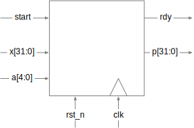
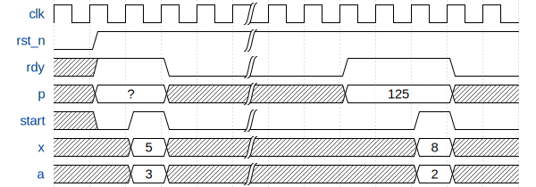

# Developing digital circuits: the POW! example


## The development process

The digital hardware development process is not just about designing hardware: it's about delivering a **clear specification** together with a **thoroughly tested** hardware module that **meets the spec**. For all but the simplest designs, designing the hardware module is actually the easy part — getting it to operate correctly in all cases and meet constraints like the target clock frequency is much more challenging.

In any serious hardware development effort — e.g., if you ever do hardware design for a living — the development process for a hardware module looks more or less like this:

1. Problem statement
2. Interface specification
    - ports
    - timing diagram
    - invariants
3. Test suite part I
    - black-box tests (i.e., independent of exact implementation)
4. Algorithm definition and circuit diagram
    - both datapath and control signals
    - for complex problems, divide into submodules
5. Test suite part II
    - clear-box tests (i.e., implementation-dependent)
6. RTL implementation
    - each module needs to have a unit testbench that tests only that module
7. Simulation (Modelsim)
    - fix bugs until all tests pass
    - add a test for each bug that is not caught by testsuite
8. Synthesis (Quartus)
    - if constraints (timing, area) violated, go back to step 4 and rethink implementation
9. $$$$$$$$$

Typically, verification (testing) requires several times more time and effort than doing the actual design. One reason for this is that having a comprehensive test suite makes the design _much easier_: you have (hopefully) already thought through all possible behaviours in steps 2 and 3, so designing the circuit in step 4 will be easier, and step 6 is just translating your circuit diagram to Verilog. Another reason is that getting things wrong can be very expensive: fabricating a few tens of samples for a large ASIC chip can cost upwards of $1mln, and if a “small bug” in a single module means that the chip does not do its job, you need to make another one.

Why write the tests first? This is actually faster because it forces you to think about all the possible behaviours and _really_ understand the problem, which makes designing the circuit much easier. And if you don't, the assumptions you made in your implementation are likely to leak into your testsuite, and as a result your testsuite probably might not cover all possible cases, which can make for a debugging nightmare.


## Example: POW!

Let's go through this process for a simple circuit which computes the _a_'th power of an input _x_.


### Problem statement

For this simple problem, this step is trivial:

- Inputs: _x_, _a_
- Outputs: _p_ = _x<sup>a</sup>_

Even so, we already have some design decisions to make. For example, we probably have an idea of what the bit widths of _x_, _a_, and _x<sup>a</sup>_ should be, and whether we want a circuit that is combinational (possible only for very small bit widths) or sequential (and takes longer if _x_ and _a_ are bigger). In this example, we will build a sequential circuit — essentially we will multiply _x_ by itself _a_–1 times.


### Interface

First, the ports. Clearly, we need at least

- input ports for _x_ and _a_, and
- an output port for the product _p_.

Because our design will take multiple steps, we will also need a _clk_ input.

But, because our circuit will take multiple steps, this is not enough. How will the user know when the result we computed is ready, and when it is safe to begin a new computation? And how will our circuit know when its inputs are ready and it should start computing?

To communicate this, we will add two signals:

- output _rdy_, which, unsurprisingly, will tell us if the result is ready and another request can be made, and
- input _start_, which will signal to our pow circuit that the inputs are ready and the computation should begin.

This leads us to the first two invariants:

- if _rdy_ is asserted, _p_ must be the correct output for the previous request, and
- if _start_ is asserted, _x_ and _a_ must be valid.

Again we are faced with a design choice: what should happen if _start_ is asserted but _rdy_ is not? If we want to specify the behaviour for this case — such as ignoring the new new request or abandoning the current request. But actually, this is not a reasonable situation, so we can instead outlaw it by adding the invariant

- _start_ may only be asserted when _rdy_ is asserted

to our spec.

This in turn means that _rdy_ must be asserted initially when our circuit “wakes up,” or else _start_ will never be allowed. But in a real ASIC, we can never be sure of the initial state at powerup — the flip-flops come up to unpredictable values — so we will need a reset signal to bring the circuit to a known state:

- _rst_n_, an active-low reset.

Resets in most hardware designs are traditionally active-low for various (partly historical) reasons, so we will keep that convention here. Active-low resets are conventionally named _rst_n_ (for reset-negedge), _rst_b_ (for reset-bar), or some variation on that.

So, in the end, our ports look like this:

<p align="center"></p>

and we can write this in SystemVerilog like this:

```SystemVerilog
module pow(input logic clk, input logic rst_n
           input logic start, input logic [31:0] x, input logic [4:0] a,
           output logic rdy, output logic [31:0] p);
    // TBD
endmodule: pow
```

But wait, this is _still_ not everything. We are designing hardware, which means that we also need to specify when things will happen — i.e., in which cycle.

Again, this means we have some design decisions. How long should we assert _start_ (and hold _x_ and _a_ steady)? One cycle? Until the pow circuit has finished computing (and _rdy_ has gone high)? And how soon should _rdy_ deassert after _start_ goes high?

In our design, we will require that _start_ be high for exactly one cycle, and that _rdy_ is already low in the next cycle after _start_. In a spec sheet, this kind of text is usually illustrated through examples in a _timing diagram_, which looks like this:

<p align="center"></p>

We can clearly see some more detail here, such as that the values of _x_ and _a_ when _start_ is low, and the value of _p_ when _rdy_ is low, are undefined, so we better not sample them during those times. Note that immediately after reset, there has been no request to the module so the value of _p_ could be anything; we could have used _////_ to indicate a don't-care value, but to me using ? instead looks less confusing and is consistent with our “if _rdy_ is asserted, _p_ must be valid” invariant.


### Black-box tests

Now we know the interface of the module, which is enough to write our first tests. These are called “black-box tests“ because we don't know / assume anything about the module implementation — we are only checking that the module behaves as advertised in the interface spec.

There are many things we should test, and a few that we should not. Some of them we can read directly off the timing diagram:

- after reset, _rdy_ should be high
- in the cycle after we assert _start_, _rdy_ should be low
- eventually _rdy_ should become high
- whenever _rdy_ is high, _p_ must be 
- after _rdy_ is back up, another request may be made

We should also, of course, test different values for _x_ and _a_. We don't need to test them all — indeed, for a large state space, we won't be able to — but we need to test as many behaviours as practical, so we must be intelligent about what we test. For example, we can identify edge cases like _x_ being 0, 1, or 2, and _a_ being 0, 1, or 2, from just considering the mathematical properties of multiplication and knowing that our circuit has to do his step by step. On the other hand, if 5<sup>5</sup> works then 5<sup>4</sup> likely does too, so we probably don't need to test both.

What should we _not_ test? Well, so far we have _blackbox_ tests, so they should not depend on any internal behaviour that is not specified. For example, we cannot check the value of _p_ when _rdy_ is low without relying on implementation-defined behaviour that is not part of the spec.

Now that we know what to test, we can write the testbench in RTL:

```SystemVerilog
module tb_pow();
    logic clk;
    logic rst_n;

    logic start;
    logic [31:0] x;
    logic [4:0] a;

    logic rdy;
    logic [31:0] p;

    pow dut(.*);

    initial begin
        clk = 0;
        forever #5 clk = ~clk;
    end

    initial begin
        rst_n <= 1'b0;
        #50;
        rst_n <= 1'b1;

        start <= 1'b0;
        #50;

        assert(rdy === 1'b1);

        x <= 32'd5;
        a <= 5'd2;
        start <= 1'b1;

        #10;

        start <= 1'b0;
        assert(rdy === 1'b0);

        @(posedge rdy);

        assert (p === 32'd25);

        #1000;

        assert(p === 32'd25);
        assert(rdy === 1'b1);

        // rest of our tests here

        $stop;
    end
endmodule: tb_pow
```

### Hardware design

For our problem, the circuit will be pretty simple: multiply the input _x_ by itself while counting down _a_ until 0. The only slightly tricky parts are that

- we have to arrange for _rdy_ to be high whenever the circuit comes out of reset, and
- we required _x_ to be stable only when _start_ was asserted, which means we need to capture that value of _x_ in case it changes later.

The circuit diagram might look like this:

<p align="center"></p>


### Clear-box tests

Now that we know exactly what we will implement, we can consider any tests that depend on the implementation and not just the interface. For example, we might test that _stored_x_ register is actually assigned properly and does not change while _cur_val_ is being updated, or assert that _count_ never exceeds the value of _a_ we provided to the circuit.


### RTL implementation

Finally, we can write the RTL. At this point, we know exactly what we want to build, and it's just a matter of translating the diagram into SystemVerilog. We will have one sequential always block for updating every flip-flop register in the design — this will cause the synthesis tool to infer a real flip-flop register from the relevant `logic`-typed variable.

```SystemVerilog
module pow(input logic clk, input logic rst_n,
           input logic start, input logic [31:0] x, input logic [4:0] a,
           output logic rdy, output logic [31:0] p);
    logic [31:0] cur_val;
    logic [4:0] count;
    logic [31:0] stored_x;

    assign rdy = count == 0;
    assign p = cur_val;

    always_ff @(posedge clk) begin
        if (!rst_n) count <= 0;
        else if (start) count <= a;
        else if (!rdy) count <= count - 1;
    end

    always_ff @(posedge clk) begin
        if (start) cur_val <= 1;
        else if (!rdy) cur_val <= cur_val * stored_x;
    end

    always_ff @(posedge clk) begin
        if (start) stored_x <= x;
    end
endmodule: pow
```

### Victory!

Once we have simulated and fixed all the bugs, we will integrate it into whatever our larger design is, synthesize everything, and load the whole thing into the FPGA — but that is a different bedtime story.
